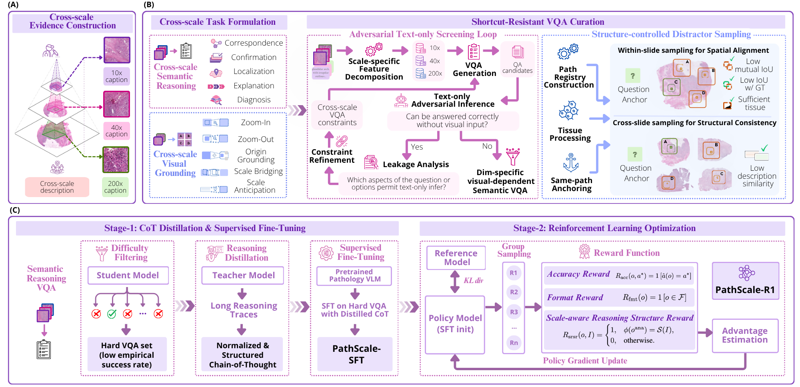
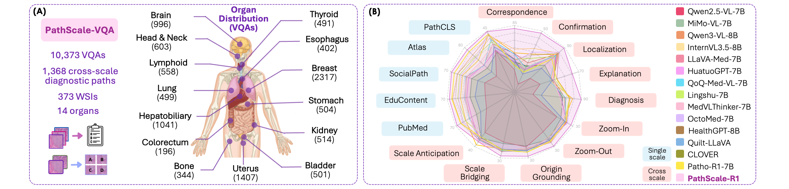
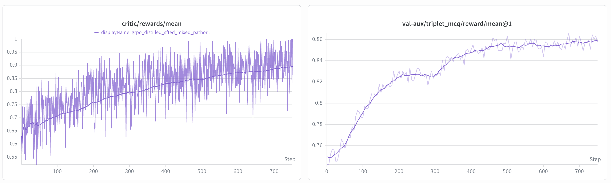

<h1 align="center">PathScale-R1: Cross-scale Reasoning for Pathological Image Analysis</h1>

<p align="center">Chi Phan*, Tianyi Zhang*, Yufeng Wu, Qiaochu Xue, Jiajie Zhang, Linghan Cai, Zeyu Liu, Sudong Wang, Yueming Jin, Dan Hu</p>

<p align="center">
  <a href="https://arxiv.org/abs/2607.23794">
    
  </a>
  <a href="https://huggingface.co/ChiPhan1110/PathScale-R1">
    
  </a>
  <a href="https://huggingface.co/ChiPhan1110/PathScale-R1">
    
  </a>
</p>

## Overview
<div align="center">


**Overview of the proposed cross-scale benchmark construction and model optimization framework.** (A) Expert-verified diagnostic
paths link clinically relevant 10×, 40×, and 200× ROIs from the same WSI, providing scale-specific captions and cross-scale evidence anchors.
(B) From these paths, we construct cross-scale semantic reasoning and visual grounding tasks, with adversarial text-only screening to reduce
language shortcuts and structure-controlled distractor sampling to reduce superficial visual shortcuts. (C) PathScale-R1 is optimized by difficulty-
driven reasoning distillation followed by reinforcement learning with accuracy, format, and scale-aware reasoning structure rewards.
</div>

<div align="center">


**Dataset statistics and benchmark performance.** (A) PathScale-VQA component statistics and organ distribution. (B) Task-wise
performance of representative VLMs across single-scale and proposed cross-scale VQA benchmark.
</div>

**Training Dynamics:**

<div align="center">

</div>


## Repository Structure

```text
PathScale-R1/
├── preprocess/
│   ├── generate_vqa_data/           # Cross-scale VQA generation and split creation
│   └── prompts/                     # Prompt templates and task constraints
├── script/
│   ├── preprocess/                  # Preprocessing entrypoints
│   ├── train/                       # SFT and GRPO training scripts
│   └── postprocess/                 # Checkpoint export / merge scripts
├── LLaMA-Factory/                   # SFT framework
├── verl/                            # RL framework
└── README.md        
```

## Getting Started

### Environment Setup

```bash
git clone [repo url placeholder]
cd PathScale-R1

cp script/.env.example script/.env
# Edit script/.env with your local paths and API keys
```

Configure `script/.env`:

```bash
# Data processing
DATA_DIR=/path/to/triplet_raw_data
ROOT=/path/to/PathScale-R1
PROCESSED_DIR=/path/to/processed_data

# Training
ACTOR_MODEL_DIR=/path/to/base_pathor1_model
LOG_DIR=/path/to/logs
WANDB_DIR=/path/to/wandb_logs
RESULTS_DIR=/path/to/results_dir

# Exporting checkpoints
RAW_CKPT_DIR=/path/to/raw_ckpt_dir
OUR_MODEL_DIR=/path/to/our_final_model_dir

# Secrets
GEMINI_API_KEY=
OPENAI_API_KEY=
DASHSCOPE_API_KEY=
HF_TOKEN=
```

### Dependencies

This repo currently uses two training stacks:

- **`verl`** for GRPO-based RL training
- **`LLaMA-Factory`** for SFT

Suggested setup:

```bash
conda create -n verl python=3.10 -y
conda activate verl
pip install -e verl/

conda create -n sft python=3.10 -y
conda activate sft
pip install -e LLaMA-Factory/
```

> CUDA / PyTorch version requirements should be finalized against the exact training environment used for release.


- Model download link: `[TODO]`
- Recommended inference backend: `[TODO]`
- System prompt / output format: `[TODO]`
- Evaluation script: `[TODO]`

## 🙏 Acknowledgements

This work was supported by the Ministry of Education, Singapore, under the Tier 1 grant (24-1250-P0001) and Tier 2 grant (T2EP20224-0028), and by PuzzleLogic Pte Ltd, Singapore.

We gratefully acknowledge the open-source projects that made the development of **PathScale-R1** possible:
- [**verl**](https://github.com/volcengine/verl), for the reinforcement learning training framework.
- [**LLaMA-Factory**](https://github.com/hiyouga/LLaMA-Factory), for the unified fine-tuning pipelines.
- [**vLLM**](https://github.com/vllm-project/vllm), for efficient large language model inference and serving.

We also acknowledge the following open-source models used for comparison in our experiments: [Qwen2.5-VL-7B](https://huggingface.co/Qwen/Qwen2.5-VL-7B-Instruct), [Qwen3-VL-8B](https://huggingface.co/Qwen/Qwen3-VL-8B-Instruct), [InternVL3.5-8B](https://huggingface.co/OpenGVLab/InternVL3_5-8B), [MiMo-VL-7B](https://huggingface.co/XiaomiMiMo/MiMo-VL-7B-RL), [LLaVA-Med-7B](https://github.com/microsoft/LLaVA-Med), [HuatuoGPT-Vision-7B](https://huggingface.co/FreedomIntelligence/HuatuoGPT-Vision-7B-Qwen2.5VL), [MedVLThinker-7B](https://github.com/UCSC-VLAA/MedVLThinker), [QoQ-Med-VL-7B](https://huggingface.co/ddvd233/QoQ-Med-VL-7B), [Lingshu-7B](https://huggingface.co/lingshu-medical-mllm/Lingshu-7B), [HealthGPT-8B](https://huggingface.co/lintw/HealthGPT-Pro-8B), [OctoMed-7B](https://huggingface.co/OctoMed/OctoMed-7B), [Quilt-LLaVA](https://huggingface.co/wisdomik/Quilt-Llava-v1.5-7b), [CLOVER](https://huggingface.co/jline/CLOVER-Qwen2.5-VL), and [Patho-R1](https://github.com/Wenchuan-Zhang/Patho-R1).

We sincerely thank the developers and contributors of these projects for their excellent work and for making their code and models publicly available to the research community.

## ❤️ Citation

If you find our work helpful, please consider citing our paper and the frameworks we build upon:

```bibtex
@article{phan2026pathscale,
  title={PathScale-R1: Cross-scale Reasoning for Pathological Image Analysis},
  author={Phan, Chi and Zhang, Tianyi and Wu, Yufeng and Xue, Qiaochu and Zhang, Jiajie and Cai, Linghan and Liu, Zeyu and Wang, Sudong and Jin, Yueming and Hu, Dan},
  journal={arXiv preprint arXiv:2607.23794},
  year={2026}
}
```

